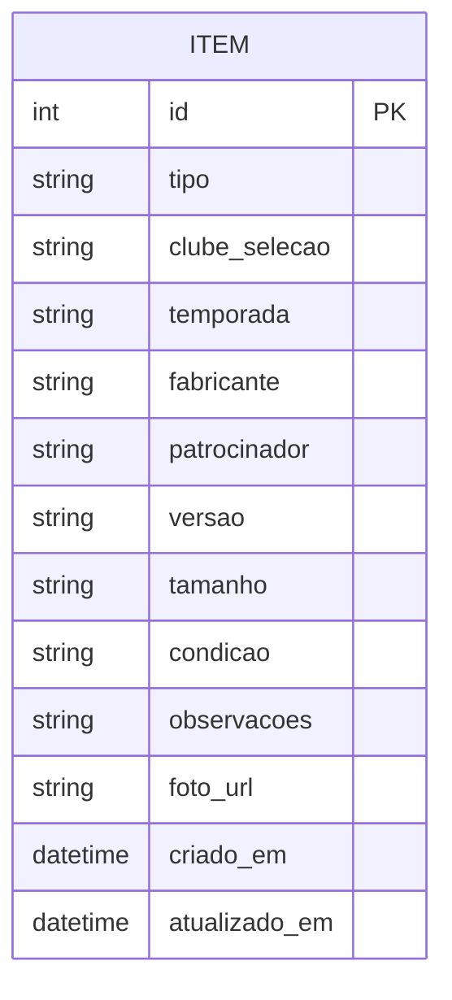

# Especificação — Catálogo de Futebol API

| | |
|---|---|
| **Projeto** | Catálogo inteligente de coleção de artigos de futebol (micro API CRUD) |
| **Versão do documento** | 1.0 |
| **Versão alvo da API** | v1.0.0 (MVP) |
| **Abordagem** | Desenvolvimento orientado por especificação, com LLM como par de programação |

---

## 1. Visão geral

### 1.1 Problema
Colecionadores de artigos de futebol (camisas, bonés, chuteiras, cachecóis etc.) possuem itens com muitos atributos (clube, temporada, fabricante, patrocinador, versão) e pouca padronização. Planilhas e anotações dispersas dificultam a organização, a busca e o controle da coleção.

### 1.2 Objetivo
Disponibilizar uma **API REST** simples para cadastrar, consultar, atualizar e remover itens de uma coleção pessoal, com filtros e paginação, documentada automaticamente (OpenAPI/Swagger) e coberta por testes automatizados.

### 1.3 Objetivos acadêmicos
- Demonstrar um ciclo de desenvolvimento **especificação → testes → implementação → revisão → commit**, com apoio de LLM.
- Manter rastreabilidade entre requisitos, critérios de aceite e testes.
- Registrar o uso do LLM (prompts, acertos, correções e limitações) em `docs/uso-de-llm.md`.

### 1.4 Usuário e contexto de uso
- **Persona:** colecionador (o próprio autor), que gerencia a coleção pessoal.
- **Cliente da API:** Swagger UI, `curl`, Postman ou um frontend futuro.
- **Uso:** single-tenant, sem autenticação no MVP (ver seção 9).

---

## 2. Escopo

### 2.1 Dentro do escopo (v1.0.0)
- CRUD completo do recurso `Item`
- Listagem com filtros e paginação
- Validação de dados e tratamento padronizado de erros
- Endpoint de verificação de saúde (`/health`)
- Documentação OpenAPI automática
- Testes automatizados, CI e release versionada

### 2.2 Fora do escopo
- Autenticação e múltiplos usuários
- Upload de arquivos (apenas `foto_url` como texto)
- Marketplace, estimativa de preço, redes sociais
- Frontend e aplicativo nativo
- Cadastro assistido por IA (ver seção 10 — opcional, pós-MVP)

---

## 3. Glossário

| Termo | Definição |
|---|---|
| Item | Qualquer artigo da coleção (camisa, boné, chuteira, cachecol, outro) |
| Versão | Variação do uniforme: titular, reserva, terceira, goleiro, treino |
| Temporada | Período de uso do item, ex.: `1998/99`, `2022` |
| Soft delete | Não utilizado. A exclusão no MVP é **física** |

---

## 4. Requisitos funcionais

| ID | Requisito | Prioridade |
|---|---|---|
| RF01 | O sistema deve permitir **criar** um item informando seus atributos | Alta |
| RF02 | O sistema deve permitir **consultar** um item pelo seu identificador | Alta |
| RF03 | O sistema deve permitir **listar** itens com paginação | Alta |
| RF04 | O sistema deve permitir **filtrar** a listagem por tipo, clube/seleção, temporada, fabricante e versão | Alta |
| RF05 | O sistema deve permitir **substituir** todos os campos de um item (PUT) | Média |
| RF06 | O sistema deve permitir **atualizar parcialmente** um item (PATCH) | Alta |
| RF07 | O sistema deve permitir **excluir** um item | Alta |
| RF08 | O sistema deve validar os dados de entrada e retornar erros claros | Alta |
| RF09 | O sistema deve expor `GET /health` para verificação de disponibilidade | Média |
| RF10 | O sistema deve registrar automaticamente data de criação e de última atualização | Média |

## 5. Requisitos não funcionais

| ID | Requisito | Critério de verificação |
|---|---|---|
| RNF01 | **Documentação automática** da API | `/docs` (Swagger UI) e `/openapi.json` acessíveis |
| RNF02 | **Testabilidade**: suíte executável com um único comando | `pytest` roda sem configuração adicional |
| RNF03 | **Cobertura de testes** | ≥ 80% (`pytest --cov`) |
| RNF04 | **Qualidade de código** | `ruff check` e `ruff format --check` sem erros |
| RNF05 | **Portabilidade** | Executa com SQLite, sem serviços externos |
| RNF06 | **Reprodutibilidade** | Dependências com versões fixas em `requirements.txt` |
| RNF07 | **Integração contínua** | Pipeline no GitHub Actions executa lint e testes a cada push/PR |
| RNF08 | **Desempenho básico** | Listagem de até 100 itens responde em menos de 500 ms em ambiente local |
| RNF09 | **Consistência de erros** | Todas as respostas de erro seguem o formato da seção 7.4 |
| RNF10 | **Rastreabilidade** | Histórico de commits em Conventional Commits; uso de LLM registrado em `docs/uso-de-llm.md` |

---

## 6. Modelo de dados

### 6.1 Entidade `Item`

| Campo | Tipo | Obrigatório | Regras |
|---|---|---|---|
| `id` | inteiro | gerado | Chave primária, autoincremento, somente leitura |
| `tipo` | enum | **sim** | `camisa`, `bone`, `chuteira`, `cachecol`, `outro` |
| `clube_selecao` | texto | **sim** | 2 a 100 caracteres, sem espaços nas extremidades |
| `temporada` | texto | não | Formato `AAAA`, `AAAA/AA` ou `AAAA/AAAA`. Ex.: `2022`, `1998/99` |
| `fabricante` | texto | não | Até 50 caracteres |
| `patrocinador` | texto | não | Até 100 caracteres |
| `versao` | enum | não | `titular`, `reserva`, `terceira`, `goleiro`, `treino` |
| `tamanho` | texto | não | Até 10 caracteres. Ex.: `P`, `M`, `G`, `GG`, `42` |
| `condicao` | enum | não | `nova`, `excelente`, `boa`, `desgastada` |
| `observacoes` | texto | não | Até 500 caracteres |
| `foto_url` | texto | não | URL válida (`http` ou `https`), até 500 caracteres |
| `criado_em` | data/hora (UTC) | gerado | Definido na criação, somente leitura |
| `atualizado_em` | data/hora (UTC) | gerado | Atualizado a cada modificação, somente leitura |

### 6.2 Diagrama ER



---

## 7. Contrato da API

**Base:** `/` (sem prefixo de versão no MVP) · **Formato:** JSON · **Codificação:** UTF-8

### 7.1 Resumo dos endpoints

| Método | Rota | Descrição | Sucesso | Erros |
|---|---|---|---|---|
| POST | `/itens` | Cria item | `201` | `422` |
| GET | `/itens` | Lista itens (filtros + paginação) | `200` | `422` |
| GET | `/itens/{id}` | Consulta item | `200` | `404`, `422` |
| PUT | `/itens/{id}` | Substitui item | `200` | `404`, `422` |
| PATCH | `/itens/{id}` | Atualiza parcialmente | `200` | `404`, `422` |
| DELETE | `/itens/{id}` | Exclui item | `204` | `404` |
| GET | `/health` | Verifica saúde | `200` | — |

### 7.2 Listagem: parâmetros de consulta

| Parâmetro | Tipo | Padrão | Comportamento |
|---|---|---|---|
| `tipo` | enum | — | Igualdade exata |
| `clube_selecao` | texto | — | Contém, sem diferenciar maiúsculas/minúsculas |
| `temporada` | texto | — | Igualdade exata |
| `fabricante` | texto | — | Contém, sem diferenciar maiúsculas/minúsculas |
| `versao` | enum | — | Igualdade exata |
| `pagina` | inteiro ≥ 1 | `1` | Página atual |
| `tamanho` | inteiro 1–100 | `20` | Itens por página |

- Filtros combinados aplicam **E lógico**.
- Ordenação fixa: `criado_em` decrescente (desempate por `id` decrescente).

### 7.3 Exemplos

**Requisição `POST /itens`**
```json
{
  "tipo": "camisa",
  "clube_selecao": "Brasil",
  "temporada": "1998",
  "fabricante": "Nike",
  "patrocinador": "Brahma",
  "versao": "titular",
  "tamanho": "G",
  "condicao": "excelente"
}
```

**Resposta `201 Created`**
```json
{
  "id": 1,
  "tipo": "camisa",
  "clube_selecao": "Brasil",
  "temporada": "1998",
  "fabricante": "Nike",
  "patrocinador": "Brahma",
  "versao": "titular",
  "tamanho": "G",
  "condicao": "excelente",
  "observacoes": null,
  "foto_url": null,
  "criado_em": "2026-10-05T14:30:00Z",
  "atualizado_em": "2026-10-05T14:30:00Z"
}
```

**Resposta `GET /itens?tipo=camisa&pagina=1&tamanho=10`**
```json
{
  "itens": [ { "id": 1, "tipo": "camisa", "...": "..." } ],
  "total": 1,
  "pagina": 1,
  "tamanho": 10
}
```

**Resposta `GET /health`**
```json
{ "status": "ok" }
```

### 7.4 Formato de erros

| Situação | Status | Corpo |
|---|---|---|
| Item inexistente | `404` | `{"detail": "Item não encontrado"}` |
| Validação de entrada | `422` | `{"detail": [{"loc": [...], "msg": "...", "type": "..."}]}` (padrão FastAPI) |

---

## 8. Regras de negócio

| ID | Regra |
|---|---|
| RN01 | `tipo` e `clube_selecao` são obrigatórios na criação e na substituição (PUT) |
| RN02 | Espaços nas extremidades de textos são removidos antes de validar e persistir |
| RN03 | Strings vazias em campos opcionais são tratadas como ausência de valor (`null`) |
| RN04 | `id`, `criado_em` e `atualizado_em` não podem ser definidos pelo cliente. Valores enviados são ignorados |
| RN05 | `atualizado_em` é renovado a cada PUT/PATCH bem-sucedido. `criado_em` nunca muda |
| RN06 | PUT exige o objeto completo. Campos opcionais omitidos voltam a `null` |
| RN07 | PATCH altera apenas os campos enviados. Enviar `null` explícito limpa um campo opcional, mas não pode limpar campos obrigatórios |
| RN08 | Campos não previstos no corpo da requisição são rejeitados com `422` |
| RN09 | A exclusão é física e irreversível |
| RN10 | Itens duplicados são permitidos (a coleção pode ter peças idênticas) |

---

## 9. Premissas e restrições

- Uso pessoal e **sem autenticação** no MVP. A API não deve ser exposta publicamente com dados sensíveis.
- Banco **SQLite** em arquivo local, configurável por variável de ambiente (`DATABASE_URL`).
- Testes usam banco **isolado** (em memória ou arquivo temporário), nunca o banco de desenvolvimento.
- Python 3.11 ou superior.

---

## 10. Funcionalidade opcional (pós-MVP): cadastro assistido por IA

> Fora do escopo da v1.0.0. Documentada aqui para evolução.

`POST /itens/sugestao-por-foto` receberia uma imagem e retornaria **sugestões** de campos (clube, temporada, fabricante, patrocinador, versão), **sem persistir** nada. O usuário revisaria e criaria o item via `POST /itens`.

Diretrizes: chamada ao LLM isolada em um módulo próprio, **mockada nos testes**, chave de API via variável de ambiente, com avaliação de acurácia por campo em conjunto de fotos reais.

---

## 11. Critérios de aceite

Formato: **Dado / Quando / Então**. Cada critério deve virar ao menos um teste automatizado.

### RF01 — Criar item
| ID | Critério |
|---|---|
| CA01 | **Dado** um corpo válido com todos os campos, **quando** `POST /itens`, **então** retorna `201`, com `id` gerado e `criado_em` = `atualizado_em` |
| CA02 | **Dado** apenas `tipo` e `clube_selecao`, **quando** `POST /itens`, **então** retorna `201` e os opcionais vêm `null` |
| CA03 | **Dado** corpo sem `clube_selecao`, **quando** `POST /itens`, **então** retorna `422` |
| CA04 | **Dado** `tipo` fora do enum, **quando** `POST /itens`, **então** retorna `422` |
| CA05 | **Dado** `temporada` em formato inválido (ex.: `"98-99"`), **quando** `POST /itens`, **então** retorna `422` |
| CA06 | **Dado** `foto_url` que não é URL válida, **quando** `POST /itens`, **então** retorna `422` |
| CA07 | **Dado** `clube_selecao` com espaços nas pontas (`"  Brasil  "`), **quando** `POST /itens`, **então** o valor é salvo como `"Brasil"` |
| CA08 | **Dado** corpo com `id` ou `criado_em` informados, **quando** `POST /itens`, **então** os valores enviados são ignorados |
| CA09 | **Dado** corpo com campo desconhecido, **quando** `POST /itens`, **então** retorna `422` |

### RF02 — Consultar item
| ID | Critério |
|---|---|
| CA10 | **Dado** um item existente, **quando** `GET /itens/{id}`, **então** retorna `200` com todos os campos |
| CA11 | **Dado** um `id` inexistente, **quando** `GET /itens/{id}`, **então** retorna `404` com `"Item não encontrado"` |
| CA12 | **Dado** um `id` não numérico, **quando** `GET /itens/abc`, **então** retorna `422` |

### RF03 — Listar com paginação
| ID | Critério |
|---|---|
| CA13 | **Dado** nenhum item cadastrado, **quando** `GET /itens`, **então** retorna `200` com `itens: []` e `total: 0` |
| CA14 | **Dado** 25 itens, **quando** `GET /itens` sem parâmetros, **então** retorna 20 itens, `total: 25`, `pagina: 1`, `tamanho: 20` |
| CA15 | **Dado** 25 itens, **quando** `GET /itens?pagina=2`, **então** retorna 5 itens |
| CA16 | **Dado** `tamanho=101` ou `pagina=0`, **quando** `GET /itens`, **então** retorna `422` |
| CA17 | **Dado** vários itens, **quando** `GET /itens`, **então** vêm ordenados do mais recente para o mais antigo |

### RF04 — Filtros
| ID | Critério |
|---|---|
| CA18 | **Dado** itens de tipos variados, **quando** `GET /itens?tipo=camisa`, **então** retorna apenas camisas |
| CA19 | **Dado** itens do "Flamengo", **quando** `GET /itens?clube_selecao=flam`, **então** retorna os itens do Flamengo (busca parcial, sem diferenciar caixa) |
| CA20 | **Dado** itens de temporadas variadas, **quando** `GET /itens?temporada=1998/99`, **então** retorna apenas essa temporada |
| CA21 | **Dado** filtros combinados (`tipo=camisa&fabricante=adidas`), **quando** `GET /itens`, **então** retorna apenas itens que atendem a **todos** |
| CA22 | **Dado** um filtro sem correspondências, **quando** `GET /itens`, **então** retorna `200` com lista vazia e `total: 0` |
| CA23 | **Dado** filtros e paginação, **quando** `GET /itens`, **então** `total` reflete o número de itens filtrados, não o total geral |
| CA24 | **Dado** `tipo=invalido`, **quando** `GET /itens`, **então** retorna `422` |

### RF05 e RF06 — Atualizar
| ID | Critério |
|---|---|
| CA25 | **Dado** um item existente, **quando** `PUT` com objeto completo válido, **então** retorna `200` com os novos valores |
| CA26 | **Dado** um item com `fabricante`, **quando** `PUT` sem `fabricante`, **então** o campo volta a `null` |
| CA27 | **Dado** `PUT` sem `clube_selecao`, **então** retorna `422` |
| CA28 | **Dado** um item existente, **quando** `PATCH` com `{"tamanho": "M"}`, **então** apenas `tamanho` muda |
| CA29 | **Dado** `PATCH` com `{"observacoes": null}`, **então** o campo é limpo |
| CA30 | **Dado** `PATCH` com `{"clube_selecao": null}`, **então** retorna `422` |
| CA31 | **Dado** PUT ou PATCH bem-sucedido, **então** `atualizado_em` é maior que o anterior e `criado_em` permanece igual |
| CA32 | **Dado** um `id` inexistente, **quando** `PUT` ou `PATCH`, **então** retorna `404` |
| CA33 | **Dado** `PATCH` com valor inválido (ex.: `tipo: "xyz"`), **então** retorna `422` e o item não é alterado |

### RF07 — Excluir
| ID | Critério |
|---|---|
| CA34 | **Dado** um item existente, **quando** `DELETE /itens/{id}`, **então** retorna `204` sem corpo |
| CA35 | **Dado** um item excluído, **quando** `GET /itens/{id}`, **então** retorna `404` |
| CA36 | **Dado** um `id` inexistente, **quando** `DELETE`, **então** retorna `404` |
| CA37 | **Dado** a exclusão de um item, **então** os demais itens permanecem inalterados |

### RF09 e requisitos não funcionais
| ID | Critério |
|---|---|
| CA38 | **Quando** `GET /health`, **então** retorna `200` com `{"status": "ok"}` |
| CA39 | **Quando** `GET /docs` e `GET /openapi.json`, **então** retornam `200` |
| CA40 | **Quando** `pytest --cov=app`, **então** todos os testes passam e a cobertura é ≥ 80% |
| CA41 | **Quando** `ruff check .` e `ruff format --check .`, **então** nenhum erro é reportado |

---

## 12. Matriz de rastreabilidade

| Requisito | Critérios de aceite | Arquivo de teste previsto |
|---|---|---|
| RF01 | CA01–CA09 | `tests/test_itens_crud.py`, `tests/test_validacoes.py` |
| RF02 | CA10–CA12 | `tests/test_itens_crud.py` |
| RF03 | CA13–CA17 | `tests/test_filtros.py` |
| RF04 | CA18–CA24 | `tests/test_filtros.py` |
| RF05, RF06 | CA25–CA33 | `tests/test_itens_crud.py`, `tests/test_validacoes.py` |
| RF07 | CA34–CA37 | `tests/test_itens_crud.py` |
| RF08 | CA03–CA09, CA12, CA16, CA24, CA27, CA30, CA33 | `tests/test_validacoes.py` |
| RF09 | CA38 | `tests/test_health.py` |
| RF10 | CA01, CA31 | `tests/test_itens_crud.py` |
| RNF01 | CA39 | `tests/test_health.py` |
| RNF03, RNF04 | CA40, CA41 | CI (`.github/workflows/ci.yml`) |

---

## 13. Estratégia de testes

| Nível | Ferramenta | Foco |
|---|---|---|
| Integração de API | `pytest` + `TestClient` (FastAPI/httpx) | Contratos, status codes, filtros, paginação |
| Unidade | `pytest` | Validadores (temporada, normalização de texto), schemas |
| Cobertura | `pytest-cov` | Mínimo de 80% |
| Qualidade estática | `ruff` | Lint e formatação |

**Isolamento:** cada teste usa banco limpo (fixture com SQLite em memória ou arquivo temporário e *override* da dependência de sessão).

**Dados de teste:** fábricas simples (`criar_item(**overrides)`) para evitar repetição.

---

## 14. Definição de pronto (DoD)

Um incremento é considerado **pronto** quando:

- [ ] Critérios de aceite correspondentes estão implementados e com testes passando
- [ ] `ruff check` e `ruff format --check` passam
- [ ] Cobertura não regrediu abaixo de 80%
- [ ] Commit segue Conventional Commits
- [ ] Interação relevante com o LLM foi registrada em `docs/uso-de-llm.md`
- [ ] CI está verde

**A release v1.0.0 está pronta quando:** todos os CA01–CA41 estão atendidos, o README está completo, o `CHANGELOG.md` está atualizado e a tag `v1.0.0` foi publicada com GitHub Release.

---

## 15. Plano de entregas e marcos

| Marco | Entrega | Critérios |
|---|---|---|
| M1 | Especificação e ambiente configurado | — |
| M2 | Criar e consultar itens | CA01–CA12 |
| M3 | Listagem, paginação e filtros | CA13–CA24 |
| M4 | Atualização e exclusão | CA25–CA37 |
| M5 | Health, CI, documentação e Docker | CA38–CA41 |
| M6 | Release v1.0.0 | DoD da release |

---

## 16. Riscos e mitigação

| Risco | Impacto | Mitigação |
|---|---|---|
| LLM gera código com bugs ou APIs desatualizadas | Médio | Testes escritos antes, revisão humana, versões fixas das dependências |
| LLM "alucina" bibliotecas ou parâmetros inexistentes | Médio | Conferir na documentação oficial e registrar o caso em `uso-de-llm.md` |
| Escopo crescer (IA, upload, frontend) | Alto | Manter seção 2.2 como contrato de escopo e tratar extras como pós-MVP |
| Testes frágeis acoplados ao banco | Baixo | Banco isolado por teste e fixtures reutilizáveis |

---

## 17. Histórico do documento

| Versão | Data | Descrição |
|---|---|---|
| 1.0 | 2026-10-05 | Versão inicial da especificação |
